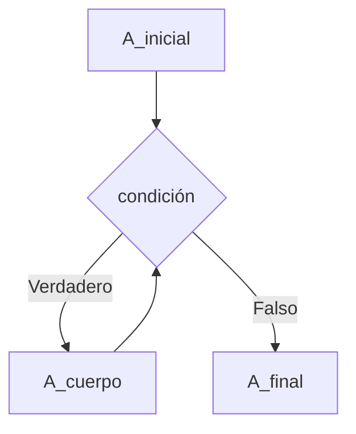
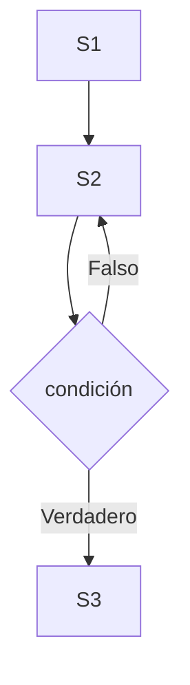
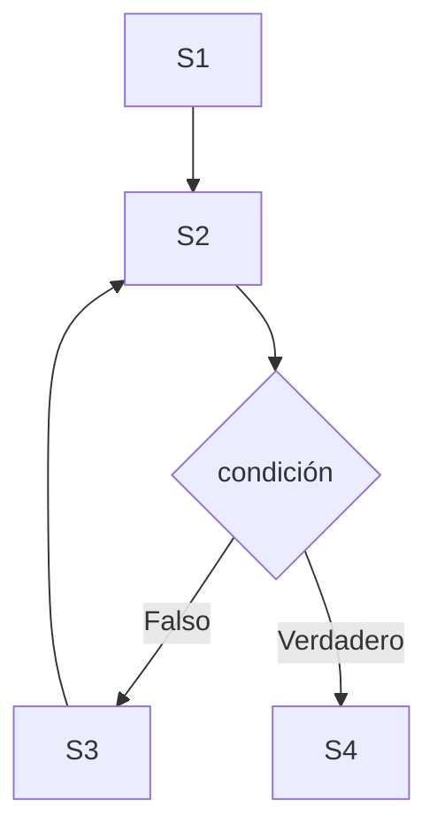

# TEMA 3: La iteración y sus formas

## 3.1 La necesidad de iterar

Existen problemas en los que el número de operaciones no puede ser fijado de antemano. Por ejemplo: calcular el valor medio de calificaciones de un grupo de alumnos introduciendo las notas una a una y terminando cuando se introduzca un número negativo.

Para resolver estos casos, es necesario establecer un ciclo que repita un conjunto de instrucciones hasta alcanzar un estado final.

**Léxico del Algoritmo**
```pseudocode
nota : Real; // nota leída 
s : Real; // suma de notas acumulada
n : Entero; // número de alumnos acumulado
```

**Algoritmo**
```pseudocode
s <- 0;
n <- 0;
Leer (nota);
SI nota >= 0 ENTONCES
    s <- s + nota;
    n <- n + 1;
    Leer (nota); 
    SI nota >= 0 ENTONCES        
        s <- s + nota;
        n <- n + 1;
        Leer (nota); 
        ...
        // Se repite hasta que v < 0
```

---

## 3.2 Composiciones iterativas

Una iteración siempre debe tener un punto (al menos) de parada. Cualquier iteración se compone de tres partes de sentencias fundamentales:
1. **Inicialización:** Tratamientos previos a la iteración.
2. **Cuerpo:** Sentencias que se repiten.
3. **Tratamientos de finalización:** Sentencias que se ejecutan cuando la iteración se detiene.

### Composición MIENTRAS
Es una composición con comprobación de parada al **principio**.
- **Sintaxis:** `MIENTRAS <condición> HACER <s> FIN_MIENTRAS`
- **Semántica:** Ejecutar la secuencia de instrucciones `<s>` mientras la `<condición>` sea verdad. Es decir, utiliza una *condición de continuación*.

```pseudocode
A_inicial // Acciones de inicialización
MIENTRAS cond HACER
    {e_k}
    A_cuerpo // Tratamiento elemental repetido
    {e_k+1}
FIN_MIENTRAS;
{e_n}
A_final // Acciones de finalización
```

### Diagrama de flujo de la composición MIENTRAS

El flujo de ejecución de una estructura MIENTRAS sigue este ciclo lógico:
1. Se ejecutan las acciones de inicialización (`A_inicial`).
2. Se evalúa la `condición` de parada.
3. **Si es Verdadero:** Se ejecutan las acciones del cuerpo (`A_cuerpo`) y el flujo vuelve obligatoriamente al punto 2 para reevaluar la condición.
4. **Si es Falso:** Se sale del bucle y se ejecutan las acciones finales (`A_final`).

**Representación en diagrama (Mermaid):**


Con esta composición ya podemos resolver el problema 
inicialmente planteado:

```pseudocode
LÉXICO
    nota :  Real;       // nota leída de la entrada 
    suma : Real;        // lleva cuenta de la suma total de las notas 
    numElem : Entero;   // lleva cuenta del número de notas leídas
ALGORITMO
    suma <- 0; numElem <- 0; Leer (nota);
    MIENTRAS nota >= 0 HACER
        suma <- suma + nota; numElem <- numElem + 1;
        Leer (nota)
    FIN_MIENTRAS;
    SI numElem > 0 ENTONCES
        Escribir ("Valor medio de las notas: ", suma/numElem)
    SI_NO Escribir ("No hay notas que promediar")
    FIN_SI
FIN.
```

### Composiciones REPETIR e ITERAR
- **REPETIR:** Iteración con parada al **final**. El cuerpo se ejecuta siempre al menos una vez. Su condición es de *parada* (se repite hasta que la condición sea verdad).
- **ITERAR:** Iteración con parada en el **medio**. La primera parte del cuerpo se ejecuta al menos una vez. Su condición también es de *parada*.

```pseudocode
// REPETIR
S1
REPETIR
    S2
HASTA condición;
S3

// ITERAR
S1
ITERAR
    S2
    DETENER condición
    S3
FIN_ITERAR;
S4
```

### Diagramas de flujo de las composiciones REPETIR e ITERAR

**Composición REPETIR (parada al final):**
En este esquema, el cuerpo del bucle (`S2`) se ejecuta siempre al menos una vez antes de evaluar la `condición`. Si la condición es Falsa, el bucle se repite. Si es Verdadera, se detiene y avanza a `S3`.



**Composición ITERAR (parada en el medio):**
Este esquema permite detener el ciclo a mitad de ejecución. Se ejecuta la primera parte del cuerpo (`S2`), se evalúa la `condición` de parada (DETENER) y:
- Si es Falsa: Continúa con la segunda parte del cuerpo (`S3`) y vuelve a empezar en `S2`.
- Si es Verdadera: Abandona el bucle inmediatamente y salta a la acción final (`S4`).



### Equivalencias
Cualquiera de estas composiciones se puede expresar en términos de las otras. Por ejemplo, un `MIENTRAS` como:
```pseudocode
S1
MIENTRAS condición HACER
    S2
FIN_MIENTRAS;
S3
```
Equivale a:
```pseudocode
S1
SI condición ENTONCES
    REPETIR
        S2
    HASTA NO condición
FIN_SI;
S3
```
```pseudocode
S1
ITERAR
DETENER NO condición
    S2
FIN_ITERAR;
S3
```

Un `REPETIR` tal que:
```pseudocode
S1
REPETIR
    S2
HASTA condición
S3
```
Equivale a:
```pseudocode
S1; S2
MIENTRAS NO condición HACER
    S2
FIN_MIENTRAS;
S3
```
```pseudocode
S1
ITERAR
    S2
DETENER condición
FIN_ITERAR;
S3
```

Un `ITERAR` tal que:
```pseudocode
S1
ITERAR
    S2
DETENER condición
    S3
FIN_ITERAR;
S4
```
Equivale a:
```pseudocode
S1; S2
SI NO condición ENTONCES
    REPETIR
        S3; S2
    HASTA condición
FIN_SI;
S4
```
```pseudocode
S1; S2
MIENTRAS NO condición HACER
    S3; S2
FIN_MIENTRAS;
S4
```

### Composición RECORRIENDO
Su inicio y parada están implícitos en sus elementos constituyentes.

**Esquema general:**
```pseudocode
k RECORRIENDO[a, b] HACER
    S
FIN_RECORRIENDO;
```
Donde:
*   `k` es una variable de un tipo ordinal declarada en el léxico (variable de control).
*   `a` y `b` definen el intervalo de valores (límite inferior y superior).
*   `S` es una sucesión de sentencias.

**Observaciones clave:**
*   El bloque de sentencias `S` **no debe modificar** el valor de la variable de control (`k`).
*   Los límites (`a` y `b`) no se reevalúan en cada iteración.
*   El bloque puede no ejecutarse ni una sola vez si el intervalo es vacío (ej. el límite inferior es mayor que el superior).
*   El valor de la variable de control al final de la iteración **no está definido**.
*   Existe la variante `EN SENTIDO INVERSO HACER` que recorre el intervalo desde `b` hasta `a`.

---

## 3.3 Ejemplos de problemas iterativos

A continuación se presentan diversos problemas clásicos resueltos mediante estructuras iterativas. Se utiliza el esquema más adecuado (`MIENTRAS` o `RECORRIENDO`) dependiendo de si el número de iteraciones es conocido de antemano o depende de una condición dinámica.

**1. Calcular el producto de dos enteros realizando únicamente sumas**
Como el número de iteraciones es conocido (sabemos que hay que sumar el valor `a`, `b` veces), podemos utilizar la iteración `RECORRIENDO`.
```pseudocode
LÉXICO
    a, b: Entero >= 0; // Datos de entrada
    p: Entero >= 0;    // Resultado
    i: Entero >= 0;    // Variable de control
ALGORITMO
    Leer (a, b);
    p <- 0;
    i RECORRIENDO [1, b] HACER
        p <- p + a 
    FIN_RECORRIENDO;
    Escribir (p);
FIN.
```

**2. Cálculo del factorial de un número natural (n!)**
Se resuelve iterando desde 1 hasta `n` y multiplicando los enteros del intervalo. Se adapta perfectamente a la composición `RECORRIENDO`.
```pseudocode
ALGORITMO
    Leer (n);
    fact <- 1;
    i RECORRIENDO[2, n] HACER
        fact <- fact * i
    FIN_RECORRIENDO;
    Escribir (fact)
FIN.
```

**3. Cálculo del Máximo Común Divisor (MCD)**
Se resuelve restando el menor de los valores al mayor hasta que ambos sean iguales. Al no saber cuántas restas harán falta, se usa obligatoriamente un `MIENTRAS` combinado con un análisis de casos.
```pseudocode
LÉXICO
    a, b, u, v : Entero > 0;
ALGORITMO
    Leer (a, b);
    u <- a; v <- b;
    MIENTRAS u != v HACER
        SEGÚN u, v
            v < u : u <- u - v
            v > u : v <- v - u
        FIN_SEGÚN
    FIN_MIENTRAS;
    Escribir (u)
FIN.
```

**4. Obtención y cuenta de los divisores propios de un entero positivo 'a'**
Se recorren los candidatos del intervalo `[2, a-1]`, comprobando mediante el resto (MOD) si son divisores.
```pseudocode
LÉXICO
    a, n, i : Entero >= 0;
ALGORITMO
    Leer (a); 
    n <- 0;
    i RECORRIENDO [2, a-1] HACER
        SI a MOD i = 0 ENTONCES
            Escribir (i); 
            n <- n + 1
        FIN_SI
    FIN_RECORRIENDO;
    Escribir (n)
FIN.
```

**5. ¿Un número 'n' es primo?**
Se busca un divisor empezando en 2. Si el primer divisor encontrado es el propio `n`, significa que es primo. El bucle se detiene dinámicamente al encontrar un resto 0.
```pseudocode
LÉXICO
    n: Entero > 0; j: Entero > 1;
ALGORITMO
    Leer (n);
    SI n = 1 ENTONCES Escribir ("1 es primo")
    SI_NO 
        j <- 2;
        MIENTRAS n MOD j != 0 HACER
            j <- j + 1
        FIN_MIENTRAS;
        SI j = n ENTONCES 
            Escribir (n, " es primo")
        SI_NO 
            Escribir (n, " no es primo") 
        FIN_SI
    FIN_SI
FIN.
```

**6. Encontrar potencias de 2 en el intervalo [x, y]**
Para calcular iterativamente y mostrar todas las potencias de 2 en un rango sin tener que recalcularlas desde cero cada vez, se guarda el estado de la potencia anterior.
```pseudocode
LÉXICO
    x : Entero >= 0;
    y, potencia2 : Entero > 0;
    i : Entero > 0;
ALGORITMO
    Leer (x, y);
    potencia2 <- 1;
    // Bucle previo para alcanzar la potencia inicial en 'x'
    i RECORRIENDO [1, x] HACER
        potencia2 <- potencia2 * 2
    FIN_RECORRIENDO;
    
    // Bucle principal para mostrar el intervalo
    i RECORRIENDO[x, y] HACER
        Escribir ("La potencia ", i, "-ésima de 2 es ", potencia2);
        potencia2 <- potencia2 * 2
    FIN_RECORRIENDO
FIN.
```

**7. Parte entera del logaritmo en base 2**
Dado `x>0`, obtener `r` tal que `2^r <= x < 2^(r+1)`. Se recorren las potencias de dos hasta superar `x`.
```pseudocode
LÉXICO
    x : Entero > 0;
    r : Entero >= 0;
    p2 : Entero > 0;
ALGORITMO
    Leer (x);
    r <- 0; p2 <- 2; // p2 será 2^(r+1) en cada paso
    MIENTRAS x >= p2 HACER
        r <- r + 1;
        p2 <- p2 * 2
    FIN_MIENTRAS;
    Escribir (r)
FIN.
```

**8. Parte entera de la raíz cuadrada de 'n'**
Basado en la propiedad pitagórica de que el cuadrado de un número es igual a la suma de esa misma cantidad de números impares consecutivos.
```pseudocode
LÉXICO
    n, rc, imp, c: Entero >= 0;
ALGORITMO
    Leer (n);
    rc <- 0; c <- 1; imp <- 1;
    MIENTRAS n >= c HACER
        imp <- imp + 2;
        c <- c + imp;
        rc <- rc + 1
    FIN_MIENTRAS;
    Escribir (rc)
FIN.
```

**9. Término 'n' de la sucesión de Fibonacci**
Sucesión recurrente: f0=1, f1=1, fi = f(i-1) + f(i-2). Se necesitan variables para llevar la cuenta de los dos términos anteriores (`ult` y `penult`).
```pseudocode
LÉXICO
    ult, penult, fibo : Entero > 0;
    n : Entero >= 0;
ALGORITMO
    Leer (n);
    SEGÚN n
        n < 2 : Escribir (1);
        n > 1 : 
            penult <- 1; ult <- 1; fibo <- 2;
            i RECORRIENDO [3, n] HACER
                penult <- ult;
                ult <- fibo;
                fibo <- ult + penult;
            FIN_RECORRIENDO;
            Escribir (fibo)
    FIN_SEGÚN
FIN.
```

---

## 3.4 Esquema general de una iteración

Toda iteración se puede visualizar como el recorrido de una secuencia de valores que toman las variables implicadas.
- `V`: Conjunto de variables implicadas.
- `V_0`: Valores iniciales de las variables.
- `P`: Condición de continuación.
- `f`: Función que representa el conjunto de operaciones que modifican `V` en cada paso.

### El problema de la parada
¿Cómo sabemos que la iteración finaliza después de un número finito de pasos? 
Que una iteración no se detenga nunca (bucle infinito) es una de las causas más frecuentes de "cuelgues". Salvo en `RECORRIENDO`, no tenemos garantía implícita de que la iteración alcance un punto de parada.

### La Función de Cota
Para garantizar la parada, podemos definir una función $T(V)$ (función de cota) desde el conjunto de las variables a los números enteros, que debe cumplir tres propiedades:

1.  Cuando la condición de continuación $P(V)$ se satisface (es verdadera), $T(V)$ toma un valor **estrictamente positivo**.
2.  En cada paso de la iteración, el valor de $T(V)$ es **estrictamente decreciente**.
3.  Cuando $T(V) <= 0$, la condición de continuación $P(V)$ es falsa.

La función $T$ puede entenderse como una "función de energía" o "medida de entropía inversa" del proceso iterativo, ya que su valor inicial acota (limita) el número máximo de iteraciones.

**Ejemplo de Función de Cota (Búsqueda de si un número 'n' es primo):**
```pseudocode
MIENTRAS n MOD j != 0 HACER
    j <- j + 1
FIN_MIENTRAS;
```
En este caso, una función de cota válida es: **$T(V) = n - j$**
*   Es estrictamente decreciente (porque $j$ se incrementa en cada paso).
*   Mientras el bucle itera, es positiva.
*   Cuando llega a 0 (es decir, $n = j$), la condición del `MIENTRAS` se evaluará y detendrá el ciclo obligatoriamente.